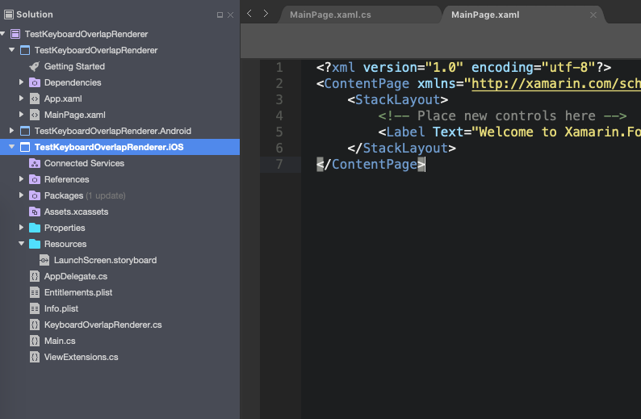

# KeyboardOverlapRenderer Xamarin iOS Custom

**Why I custom this lib**

- This is a very small project I clone and fix from KeyboardOverlapRenderer of paulpatarinski.

Link: https://github.com/paulpatarinski/Xamarin.Forms.Plugins/tree/master/KeyboardOverlap

- My purpose when I custom this KeyboardOverlapRenderer of paulpatarinski:

I have trouble about implement the nudget KeyboardOverlapRenderer https://github.com/paulpatarinski/Xamarin.Forms.Plugins/tree/master/KeyboardOverlap .
The problem is "When the keyboard frame changes, the view doesn't update again".

So I decide customing this lib again.

**My implementation**

- Add observer for case "UIKeyboard.WillChangeFrameNotification"

- Fix some bug relate to shift page

**How to implement**

It's very simple to implement. Only copy the "KeyboardOverlapRenderer.cs"  "ViewExtensions.cs" to your iOS project.

Example:

**How to use and licence**

Refer this repo: https://github.com/paulpatarinski/Xamarin.Forms.Plugins/tree/master/KeyboardOverlap

**Contact me**

Mail: tranducsang2910@gmail.com

- Tag:
#keyboard #overlap #iOS #xamarin
